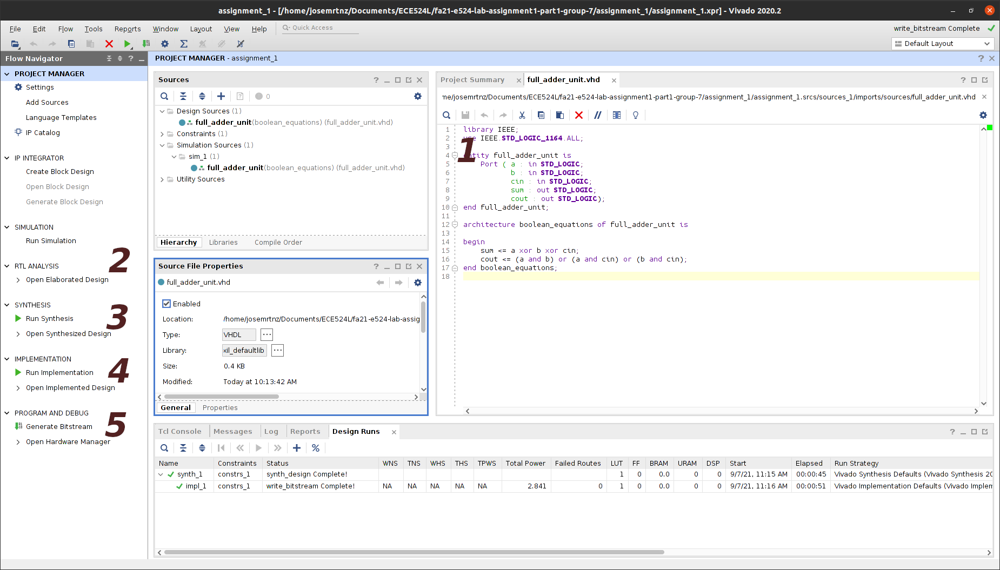
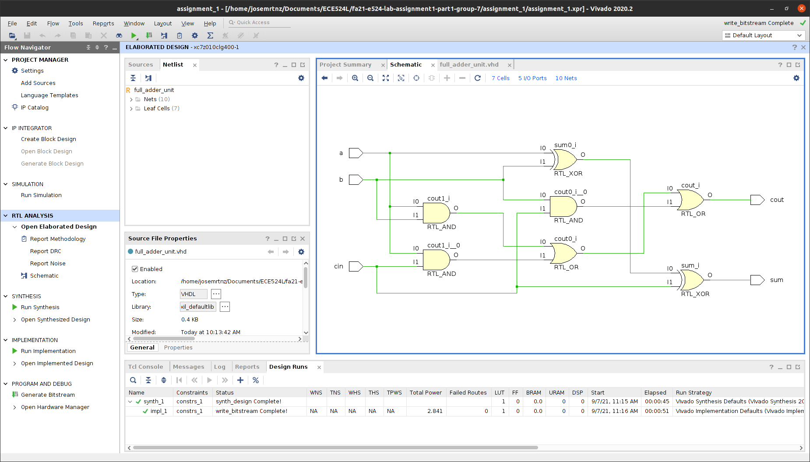
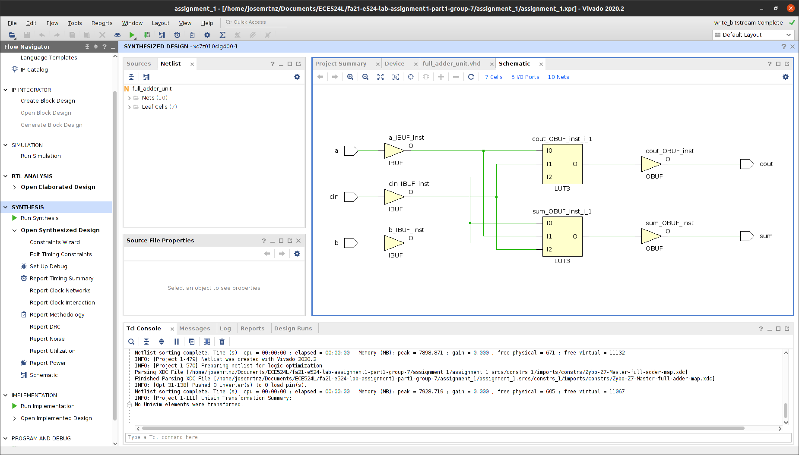
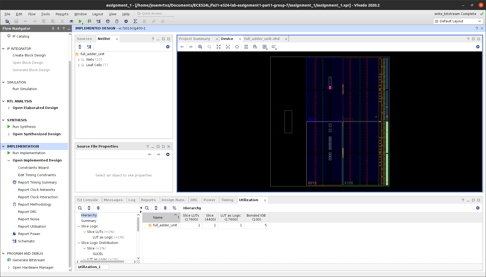
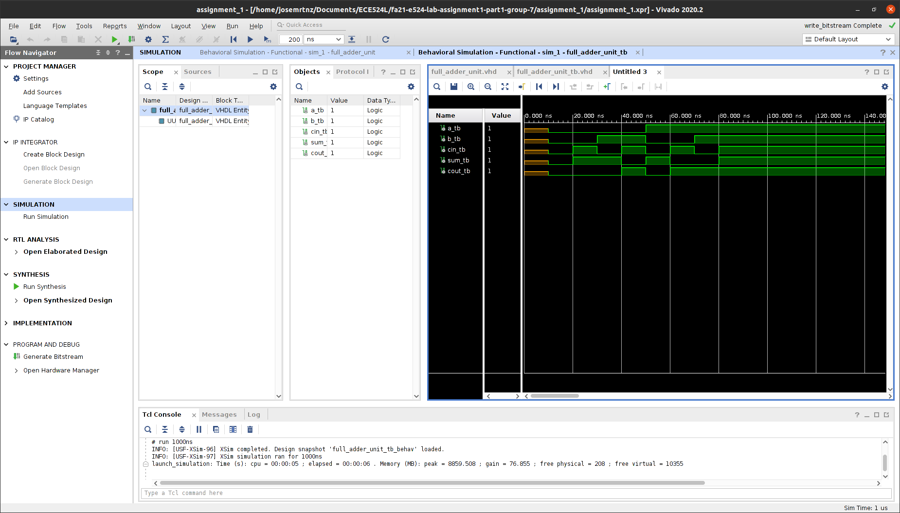

# ECE --- Fall 2021
**California State University, Northridge**  
**Department of Electrical and Computer Engineering**  

# Lab 1 - Exploring Xilinx Vivado IDE

**Report Created by:**
- Group 7
- Jose Luis Martinez

**Submission date:** 09/07/2021

## Development board
Select the which dev board you targeted for this project:
- [x] Zybo Z7-10
- [ ] Nexys 7 A7-100T

## Task 1 result

## Task 2 result

## Task 3 result

## Task 4 result

## Task 5 result

## Task 6 result
Change the following question to yes when you pushed your code to remote repo.   
Your submitted assignment must be synthesizable to get the full point.  
Have you pushed your project to remote repo? Yes

## Task 7 result
[Working Demo on Zybo 7010](https://youtu.be/2I9zp8i7lqg)
-------------
-------------
Change the following question to yes when you are done with this assignment. The instructor will use this question to determine if your assignment is ready for review.
## Is assignment ready for review? Yes
