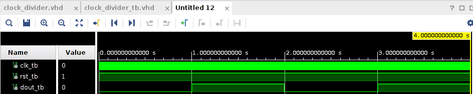
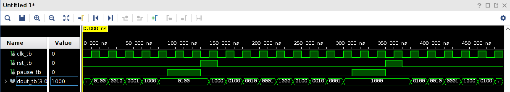
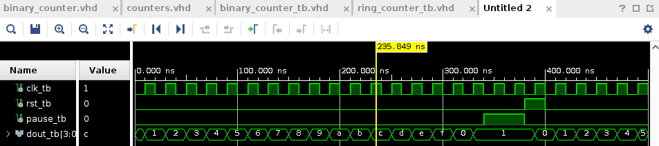
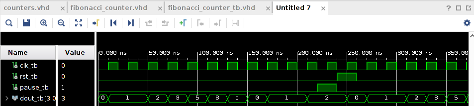
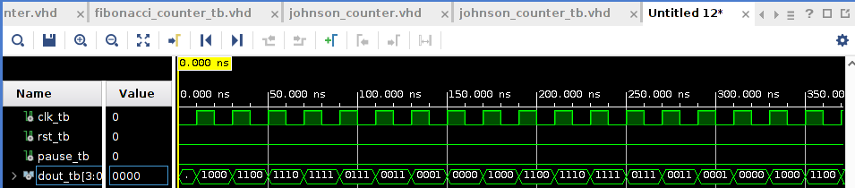
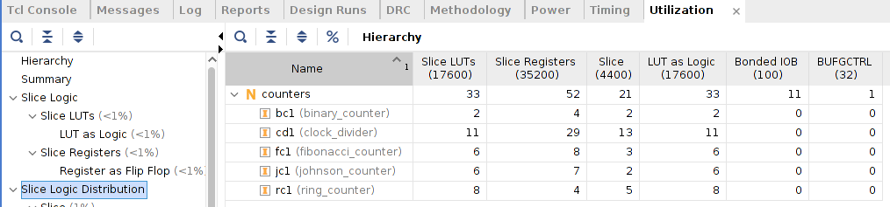
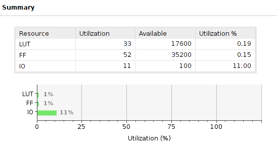

# CSUN ECE 524L Fall 2021
## Lab 1 - Exploring Xilinx Vivado IDE and Development Board

**Report Created by:**
- Group 7
- Jose Luis Martinez
- **Software:** *Vivado 2020.2*

**Submission date:** 09/19/2021

## Introduction
In this Lab we will be exploring, designing, and going through the stages of development all in the Xilinx Vivado IDE. This labs purpose is to ensure that we know how to use and navigate the software used for ECE 524/L. The following counters will be designed: **Ring**, **Binary**, **Fibonacci**, and **Johnson Counter**. A **Clock Divider** will be used in order to slow down the clock down enough to see the changes in the counters. 

## Pre-Lab
### Questions
:question: **Question 1:** Explain what the constraint file is and how it helps you use the resources on FPGA development board? Explain how you add a constraint file to an existing design?

Xilinx Design Constraints (XDC) define the requirements that the compiler must follow in order for it to work on the targeted board. You can use the XDC file to specify what a certain pin represents such as a clock signal or switch. You can add a constraint file to an existing design by navigating to **File->Add Sources** then in the window that opens up select **Add or create constraints**. Then just add the constraints file that you already have and click **Finish**. From there you can add/edit any constraints for that design.

:question: **Question 2:** How do you access the FPGA resource information for any design? i.e. number of flip flops or LUTs?

In the **Flow Navigator** window click **Run Implementation**, if the design is out of date or hasn't been synthesized, Vivado will try to synthesize your design fist before run implementation. Now click the arrow button next to **Open Implementation Design** to expand the menu. Then click on **Report Utilization** and you will be able to see resources utilized by your design. 

:question: **Question 3:** How do you observe real time delays on simulation waveforms that is generated by Xilinx Vivado software? How do you select between different types of simulation in Vivado software and what are the differences?

To view simulation waveforms in Vivado, make sure your desired tb file is bold if not right click and make it the top. Then a waveform window should open up. Save the waveform to open it again from the project sources. When you click on simulation and if you already ran synthesis and implementation you will get options to run timing and functional simulations.

:question: **Question 4:** What file is used to program the FPGA? Where is this file located?

The file used to program the fpga is generated after **Synthesis** and **Implementation** have been run then clicking on **Generate Bitstream**. The file generated is a bitstream file with a .bit. The file is saved by default to Project Folder/Project Name.runs/impl_1/design_name.bit.

:question: **Question 5:** What is the clock frequency of the onboard oscillator? What are the options if you need a different frequency? Can you use external oscillator? How?

The Zybo 7010 provides us with a 33MHz clock source for the PS and a 125MHz clock for the PL according to the [Zybo Z7 Reference Manual](https://www.digikey.com/htmldatasheets/production/3205128/0/0/1/zybo-z7-board-reference-manual.html?utm_adgroup=xGeneral&utm_source=google&utm_medium=cpc&utm_campaign=Dynamic%20Search_EN_Product&utm_term=&utm_content=xGeneral&gclid=CjwKCAjwhOyJBhA4EiwAEcJdcSJ2yFjBeoe9J1otUO-ejKB7WcW8_dTODWfzn1zRbN_oXYRJPX-PGhoCWLIQAvD_BwE#pff). You can use an external oscillator by connecting the oscillator to one of the pmod ports on the Zybo. Then in the constraints file enable the port.

:question: **Question 6:** Assuming the LED switching frequency is to be 1 Hz, how can you make the FPGA input clock faster or slower than 1 Hz?

In this project my clock divider switches from high-low or high-low when the counter reaches a desired value. Thus we can make the frequency we want by using this formula: $Count(f_{req})=\frac{125MHz}{2f_{req}}-1$, so when we plug in 1Hz, the amount our counter should count to is to 62,499,99 thus reducing the frequency to 1Hz. Using this knowledge we can speed up the clock by reducing the amount to count. To slow down the clock, simply make the counter count higher.

## Procedure
> The following were completed in order to satisfy all of the tasks of assignment 1 part 2.
> 
1. A clock divider called `clock_divider.vhd` was created to slow down the PL clock from 125MHz to 1Hz.
   1. The design is shown below:
```vhdl library IEEE;
use IEEE.STD_LOGIC_1164.ALL;
use IEEE.NUMERIC_STD.ALL;

entity clock_divider is
    Port ( clk : in STD_LOGIC;
           rst : in STD_LOGIC;
           dout : out STD_LOGIC);
end clock_divider;

architecture Behavioral of clock_divider is

signal count: unsigned(27 downto 0) := "0000000000000000000000000000";
signal douts: std_logic := '0';

begin

process(clk)
begin
    
    if(rising_edge(clk)) then
        if (rst='1') then
            count <= count and "0000000000000000000000000000";
        elsif (count >= 62499999) then
            count <= count and "0000000000000000000000000000";
            douts <= not douts;
        else 
            count <= count + "1";
        end if;
    else
        count <= count;
    end if;
end process;
        
dout <= douts;

end Behavioral; 
```
2. Constraints file `Zybo-Z7-Master-full-adder-map.xdc` was edited to enable the clock for PL, switches, buttons, and leds.
3. A ring counter `ring_counter.vhd` was created by taking starting array of "1000" and shifting right every positive edge of the clock cycle.
   1. The design is shown below:
```vhdl
library IEEE;
use IEEE.STD_LOGIC_1164.ALL;
use IEEE.NUMERIC_STD.ALL;

entity ring_counter is
    Port ( clk : in STD_LOGIC;
           rst : in STD_LOGIC;
           pause : in STD_LOGIC;
           dout : out STD_LOGIC_VECTOR(3 downto 0));
end ring_counter;

architecture Behavioral of ring_counter is

signal count : unsigned(3 downto 0) := "1000";

begin

process(clk)
begin
    if(rising_edge(clk)) then
        if(rst='1') then
            count <= "1000";
        elsif(pause='1') then
            count <= count;
        else
            count <= rotate_right(count, 1);
        end if;
    else 
        count <= count;
    end if;
end process;

dout <= std_logic_vector(count); 

end Behavioral;
```
4. A binary counter `binary_counter.vhd` was created by having a process where a 4 bit signal kept incrementing every positive edge of the clk and has a synchronous reset and pause. 
   1. The design is shown below:
```vhdl
library IEEE;
use IEEE.STD_LOGIC_1164.ALL;
use IEEE.NUMERIC_STD.ALL;


entity binary_counter is
    Port ( clk : in STD_LOGIC;
           rst : in STD_LOGIC;
           pause : in STD_LOGIC;
           dout : out STD_LOGIC_VECTOR (3 downto 0));
end binary_counter;

architecture Behavioral of binary_counter is

signal count: unsigned(3 downto 0) := "0000";

begin

process(clk)
begin
    if(rising_edge(clk)) then
        if (rst='1') then
            count <= "0000";
        elsif (pause='1') then
            count <= count;
        else
            count <= count + "1";
        end if;
    else 
        count <= count;
    end if;
end process;

dout <= std_logic_vector(count);

end Behavioral;
```
5. A fibonacci counter `fibonacci_counter.vhd` was created by having three variables fn, fn1, and fn2 where these represent various states of the fibonacci sequence. The maximum number of the fibonacci sequence that can be displayed with 4-bits of information is 13. So in my design whenever my process detects a 13 the next cycle the sequence will restart. The design will go on the next number in the sequence every positive edge of the clk and has a synchronous reset and pause.
   1. The design is shown below:
```vhdl
library IEEE;
use IEEE.STD_LOGIC_1164.ALL;
use IEEE.NUMERIC_STD.ALL;

entity fibonacci_counter is
    Port ( clk : in STD_LOGIC;
           rst : in STD_LOGIC;
           pause : in STD_LOGIC;
           dout : out STD_LOGIC_VECTOR (3 downto 0));
end fibonacci_counter;

architecture Behavioral of fibonacci_counter is

signal fn: unsigned(3 downto 0) := "0000";
signal fn1 : unsigned(3 downto 0) := "0001";
signal fn2: unsigned(3 downto 0) := "0000";

begin

process(clk)
begin
    if(rising_edge(clk)) then
        if(rst='1' or fn="1101") then
            fn <= "0000";
            fn1 <= "0001";
            fn2 <= "0000";
        elsif (pause='1') then
            fn <= fn;
            fn1 <= fn1;
            fn2 <= fn2;
        else
            fn <= fn1;
            fn1 <= fn2;
        end if;
    else
        fn <= fn;
        fn1 <= fn1;
        fn2 <= fn2;
    end if;

    fn2 <= fn + fn1;
end process;

dout <= std_logic_vector(fn);

end Behavioral;
```

6. A johnson counter was designed `johnson_counter.vhd` was created by having a 3-bit count signal that will add '1' and shift right for values "000" to "100" and add '0' and shift right for every positive edge of the clock. The design has a synchronous reset and pause.
   1. The design is shown below:
```vhdl
library IEEE;
use IEEE.STD_LOGIC_1164.ALL;
use IEEE.NUMERIC_STD.ALL;

entity johnson_counter is
    Port ( clk : in STD_LOGIC;
           rst : in STD_LOGIC;
           pause : in STD_LOGIC;
           dout : out STD_LOGIC_VECTOR (3 downto 0));
end johnson_counter;

architecture Behavioral of johnson_counter is

signal count: unsigned(2 downto 0) := "000";
signal jCount: std_logic_vector(3 downto 0) := "0000";

begin

process(clk)
begin
    if(rising_edge(clk)) then
        if(rst='1') then
            jCount <= "0000";
            count <= "000";
        elsif (pause='1') then
            jCount <= jCount;
            count <= count;
        elsif (count < "100") then
            jCount(TO_INTEGER(3-count)) <= '1';
            count <= count + "1";
        else 
            jCount(TO_INTEGER(7-count)) <= '0';
            count <= count + "1";
        end if;
     else 
        jCount <= jCount;
        count <= count;
    end if;
end process;

dout <= jCount;

end Behavioral;
```
7. A file called `counters.vhd` was made and it instantiated all of the counters including the clock divider. The inputs of the top level module were **clksys**, **btn**, **sw**, and output was **led**. The clock divider took in the **sysclk** its output was then connected to the clk inputs of the other four counters. Then **btn(0)** and **sw[3]** was connected to all the resets of the counters. Then to select the output for the **led** a with select statement was used, where the selecting bits was sw(2 downto 0) and the choices to select from were the outputs of the four counters. 
   1. The design is shown below:
```vhdl
library IEEE;
use IEEE.STD_LOGIC_1164.ALL;
use IEEE.NUMERIC_STD.ALL;

entity counters is
    Port ( clksys: in std_logic;
           btn: in std_logic_vector(3 downto 0);
           sw: in std_logic_vector(3 downto 0);
           led: out std_logic_vector(3 downto 0));
end counters;

architecture Behavioral of counters is

component clock_divider is
    Port ( clk : in STD_LOGIC;
           rst : in STD_LOGIC;
           dout : out STD_LOGIC);
end component clock_divider;

component ring_counter is
    Port ( clk : in STD_LOGIC;
           rst : in STD_LOGIC;
           pause : in STD_LOGIC;
           dout : out STD_LOGIC_VECTOR(3 downto 0));
end component ring_counter;

component binary_counter is
    Port ( clk : in STD_LOGIC;
           rst : in STD_LOGIC;
           pause : in STD_LOGIC;
           dout : out STD_LOGIC_VECTOR (3 downto 0));
end component binary_counter;

component fibonacci_counter is
    Port ( clk : in STD_LOGIC;
           rst : in STD_LOGIC;
           pause : in STD_LOGIC;
           dout : out STD_LOGIC_VECTOR (3 downto 0));
end component fibonacci_counter;

component johnson_counter is
    Port ( clk : in STD_LOGIC;
           rst : in STD_LOGIC;
           pause : in STD_LOGIC;
           dout : out STD_LOGIC_VECTOR (3 downto 0));
end component johnson_counter;

signal rCLK: std_logic; 
signal pauseS: std_logic := '0';
signal outRC, outBC, outFC, outJC: std_logic_vector(3 downto 0);
signal mode: std_logic_vector(2 downto 0);

begin

pauseS <= sw(3);
mode <= sw(2 downto 0);

cd1: clock_divider port map (clk => clksys, rst => btn(2), dout => rCLK);
rc1: ring_counter port map (clk => rCLK, rst => btn(0), pause => pauseS, dout => outRC);
bc1: binary_counter port map (clk => rCLK, rst => btn(0), pause => pauseS, dout => outBC);
fc1: fibonacci_counter port map (clk => rCLK, rst => btn(0), pause => pauseS, dout => outFC);
jc1: johnson_counter port map (clk => rCLK, rst => btn(0), pause => pauseS, dout => outJC);

with mode select
    led <= outRC when "000",
           outBC when "001",
           outFC when "010",
           outJC when "100",
           "0000" when others;
          

end Behavioral;
```
## Testing Strategy
Test benches were used to stimulate each of counters. 
1. For the `clock_divider.vhd` I simulated the design run up to 4 seconds with no other input. This took a while to simulate so I had to use a different period.
   1. Test bench file `clock_divider_tb.vhd` is shown below:
```vhdl
library IEEE;
use IEEE.STD_LOGIC_1164.ALL;
use IEEE.NUMERIC_STD.ALL;


entity clock_divider_tb is
--  Port ( );
end clock_divider_tb;

architecture Behavioral of clock_divider_tb is

component clock_divider is
    Port ( clk : in STD_LOGIC;
           rst : in STD_LOGIC;
           dout : out STD_LOGIC);
end component clock_divider;

signal clk_tb, rst_tb, dout_tb: std_logic;

begin

cd1: clock_divider port map (clk => clk_tb, rst => rst_tb, dout => dout_tb);


process
begin
clk_tb <= '0';
rst_tb <= '1';
wait for 10ns;
clk_tb <= '1';
wait for 10ns;
end process;


end Behavioral;
```
2. For the `ring_counter.vhd` pause and reset are tested and 2 cycles are simulated through Vivado.
   1. The test bench file `ring_counter_tb.vhd` is shown below:
```vhdl
library IEEE;
use IEEE.STD_LOGIC_1164.ALL;
use IEEE.NUMERIC_STD.ALL;


entity ring_counter_tb is
--  Port ( );
end ring_counter_tb;

architecture Behavioral of ring_counter_tb is

component ring_counter is
    Port ( clk : in STD_LOGIC;
           rst : in STD_LOGIC;
           pause : in STD_LOGIC;
           dout : out STD_LOGIC_VECTOR(3 downto 0));
end component ring_counter;

signal clk_tb, rst_tb, pause_tb: std_logic;
signal dout_tb: std_logic_vector(3 downto 0);

begin

rc1: ring_counter port map(clk => clk_tb, rst => rst_tb, pause => pause_tb, dout => dout_tb);

process
begin
    clk_tb <= '0';
    wait for 10ns;
    clk_tb <= '1';
    wait for 10ns;
end process;

process
begin
    rst_tb <= '0';
    pause_tb <= '0';
    wait for 100ns;
    pause_tb <= '1';
    wait for 40ns;
    pause_tb <= '0';
    rst_tb <= '1';
    wait for 20ns;
    rst_tb <= '0';
    wait for 60ns;
end process;

end Behavioral;
```
3. For the `binary_counter.vhd` pause and reset are tested and 2 cycles are simulated through Vivado.
   1. The test bench file `binary_counter_tb.vhd` is shown below:
```vhdl
library IEEE;
use IEEE.STD_LOGIC_1164.ALL;
use IEEE.NUMERIC_STD.ALL;

entity binary_counter_tb is
--  Port ( );
end binary_counter_tb;

architecture Behavioral of binary_counter_tb is

component binary_counter is
    Port ( clk : in STD_LOGIC;
           rst : in STD_LOGIC;
           pause : in STD_LOGIC;
           dout : out STD_LOGIC_VECTOR (3 downto 0));
end component binary_counter;

signal clk_tb, rst_tb, pause_tb: std_logic;
signal dout_tb: std_logic_vector(3 downto 0);

begin

bc1: binary_counter port map(clk => clk_tb, rst => rst_tb, pause => pause_tb, dout => dout_tb);

process
begin
    clk_tb <= '0';
    wait for 10ns;
    clk_tb <= '1';
    wait for 10ns;
end process;

process
begin
    rst_tb <= '0';
    pause_tb <= '0';
    wait for 340ns;
    pause_tb <= '1';
    wait for 40ns;
    pause_tb <= '0';
    rst_tb <= '1';
    wait for 20ns;
    rst_tb <= '0';
    wait for 60ns;
end process;


end Behavioral;
```
4. For the `fibonacci_counter.vhd` pause and reset are tested and 1 cycle are simulated through Vivado.
   1. The test bench file `fibonacci_counter_tb.vhd` is shown below:
```vhdl
library IEEE;
use IEEE.STD_LOGIC_1164.ALL;
use IEEE.NUMERIC_STD.ALL;

entity fibonacci_counter_tb is
--  Port ( );
end fibonacci_counter_tb;

architecture Behavioral of fibonacci_counter_tb is

component fibonacci_counter is
    Port ( clk : in STD_LOGIC;
           rst : in STD_LOGIC;
           pause : in STD_LOGIC;
           dout : out STD_LOGIC_VECTOR (3 downto 0));
end component fibonacci_counter;

signal clk_tb, rst_tb, pause_tb: std_logic;
signal dout_tb: std_logic_vector(3 downto 0);

begin

fc1: fibonacci_counter port map (clk => clk_tb, rst => rst_tb, pause => pause_tb, dout => dout_tb);

process
begin
    clk_tb <= '0';
    wait for 10ns;
    clk_tb <= '1';
    wait for 10ns;
end process;

process
begin
    rst_tb <= '0';
    pause_tb <= '0';
    wait for 220ns;
    pause_tb <= '1';

    wait for 20ns;
    pause_tb <= '0';
    rst_tb <= '1';
    
    wait for 20ns;
    rst_tb <= '0';
    
    wait for 20ns;
end process;

end Behavioral;
```
5. For the `johnson_counter.vhd` pause and reset are tested and 2 cycles are simulated through Vivado.
   1. The test bench file `johnson_counter_tb.vhd` is shown below:
```vhdl
library IEEE;
use IEEE.STD_LOGIC_1164.ALL;
use IEEE.NUMERIC_STD.ALL;

entity johnson_counter_tb is
--  Port ( );
end johnson_counter_tb;

architecture Behavioral of johnson_counter_tb is

component johnson_counter is
    Port ( clk : in STD_LOGIC;
           rst : in STD_LOGIC;
           pause : in STD_LOGIC;
           dout : out STD_LOGIC_VECTOR (3 downto 0));
end component johnson_counter;

signal clk_tb, rst_tb, pause_tb: std_logic;
signal dout_tb: std_logic_vector(3 downto 0);

begin

fc1: johnson_counter port map (clk => clk_tb, rst => rst_tb, pause => pause_tb, dout => dout_tb);

process
begin
    clk_tb <= '0';
    wait for 10ns;
    clk_tb <= '1';
    wait for 10ns;
end process;

process
begin
    rst_tb <= '0';
    pause_tb <= '0';
    wait for 40ns;
end process;

end Behavioral;
```

## Results (Data)

`clock_divider_tb.vhd` waveform output


`ring_counter_tb.vhd` waveform output


`binary_counter_tb.vhd` waveform output


`fibonacci_counter_tb.vhd` waveform output


`johnson_counter_tb.vhd` waveform output

## [Video Demonstration](https://youtu.be/l4pR6QMvVwk)

## FPGA Resources



counters resource utilization on Zybo Z7

## Conclusion
In conclusion, in this lab I learned how to map pins on the fpga to my top level design. Also reading through the new Zybo Z7 manual found [here](https://www.digikey.com/htmldatasheets/production/3205128/0/0/1/zybo-z7-board-reference-manual.html?utm_adgroup=xGeneral&utm_source=google&utm_medium=cpc&utm_campaign=Dynamic%20Search_EN_Product&utm_term=&utm_content=xGeneral&gclid=CjwKCAjwhOyJBhA4EiwAEcJdcSJ2yFjBeoe9J1otUO-ejKB7WcW8_dTODWfzn1zRbN_oXYRJPX-PGhoCWLIQAvD_BwE#pff), it turns out that PLL clock is actually 125MHz and not 50MHz that was previously stated in the lab manual. Besides that this lab was more of a review for me from ECE 420. 

-------------
-------------
Change the following question to yes when you are done with this assignment.  
The instructor will use this question to determine if your assignment is ready for review.  
# Is assignment ready for review? Yes
