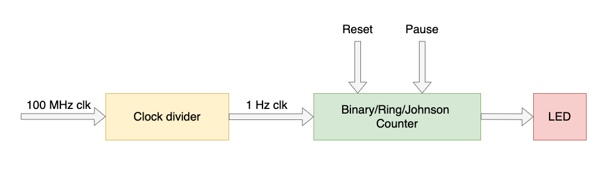

# ECE 524L Fall 2021
**California State University, Northridge**  
**Department of Electrical and Computer Engineering**  

# Lab 1 - Exploring Xilinx Vivado IDE and Development Board

## Objective

After completing this lab, students will be able to:
- Create a Vivado project sourcing HDL model(s) and targeting a specific FPGA device located on the development board
- Use the provided Xilinx Design Constraint (XDC) file to constrain the pin locations
- Simulate the design using the Vivado simulator
- Synthesize and implement the design 
- Generate the bitstream
- Configure FPGA directly and through onboard flash memory

## Requirements

The following material is required to complete the lab:
- Xilinx Vivado 2019.1
- Zybo Z7 development board
- USB Programming cable

## References

- [Xilinx FPGA data sheets](http://www.xilinx.com)
- [Software Manual](http://www.support.xilinx.com)
- [Vivado 2019.1 installation guide](https://www.xilinx.com/support/documentation/sw_manuals/xilinx2019_1/ug973-vivado-release-notes-install-license.pdf)
- [Vivado 2019.1 getting Started guide](https://www.xilinx.com/support/documentation/sw_manuals/xilinx2019_2/ug910-vivado-getting-started.pdf)
-[Vivado 2019.1 Introduction to FPGA Design with Vivado HLS](https://www.xilinx.com/support/documentation/sw_manuals/ug998-vivado-intro-fpga-design-hls.pdf)
- [Vivado 2019.1 design flow](https://www.xilinx.com/support/documentation/sw_manuals/xilinx2019_2/ug888-vivado-design-flows-overview-tutorial.pdf)
- [Vivado 2019.1 implementation guide](https://www.xilinx.com/content/dam/xilinx/support/documentation/sw_manuals/xilinx2019_1/ug904-vivado-implementation.pdf)
- [Vivado 2019.1 Using Constraints](https://www.xilinx.com/support/documentation/sw_manuals/xilinx2019_1/ug903-vivado-using-constraints.pdf)

## Introduction

This lab introduces the Zybo Z7, Xilinx Vivado IDE, and their features. You will design a simple 8 bit counter to download to the Zybo Z7. The timing of the counter is controlled by the onboard clock signal. There is also a reset button, direction, and a pause switch to add more features to the counter. Furthermore the 8 bit counter should light up the LEDs on the development board. As the clock frequency generated by the onboard oscillator has a high frequency and consequently the counts on the LEDs cannot be observed therefore the clock needs to be slowed down. A second counter needs to be designed to slow down the frequency to roughly about 1 Hz so switching can be observed. Figure 1 shows the block diagram of the design used in this lab. 
 


Figure 1.1: Top level block diagram of the counter design

## Questions
Answer the following questions in the pre-lab section of your report:

:question: **Question 1:** Explain what the constraint file is and how it helps you use the resources on FPGA development board? Explain how you add a constraint file to an existing design?

Hint: Find the answer in [Vivado 2019.1 Using Constraints](https://www.xilinx.com/support/documentation/sw_manuals/xilinx2019_1/ug903-vivado-using-constraints.pdf)

:question: **Question 2:** How do you access the FPGA resource information for any design? i.e. number of flip flops or LUTs?

Hint: Find the answer in https://www.youtube.com/watch?v=vlh9X3jFKTI

:question: **Question 3:** How do you observe real time delays on simulation waveforms that is generated by Xilinx Vivado software? How do you select between different types of simulation in Vivado software and what are the differences?

Hint: Look at RTL Analysis in Vivado Project Design Flow menu

:question: **Question 4:** What file is used to program the FPGA? Where is this file located?

Hint1: Look at Generate Bitstream menu and investigate what files it creates
Hint2: Look at xx.runs/impl_1/ folder in your project and look for a *.bit file

:question: **Question 5:** What is the clock frequency of the onboard oscillator? What are the options if you need a different frequency? Can you use external oscillator? How?

Hint: See Section 12 Clock Sources of [ZYBO FPGA Board Reference Manual](https://digilent.com/reference/_media/zybo:zybo_rm.pdf)

:question: **Question 6:** Assuming the LED switching frequency is to be 1 Hz, how can you make the FPGA input clock faster or slower than 1 Hz?

Hint: Think about counters.

## Procedure

:point_right: **Task 1:** Design a frequency divider counter that slows down the input clock frequency to the FPGA to 1 Hz.
If we assume the FPGA clock rate is 50 MHz, it means we have 50,000,000 cycles/second. Since we will use a 50% duty cycle, we need a counter that counts from 0 to 24,999,999 and toggles a signal when it reaches the max value.

- Create a separate source file and name it `clock_divider.vhd`
- Create a testbench to simulate your clock divider. Name the testbench file `clock_divider_tb.vhd`.

Note: User a synchronous reset for your clock divider.

:point_right: **Task 2:** Create a source file named `counters.vhd`. This file should be used for all the counters that you will be implementing in the next tasks.

:point_right: **Task 3:** Update the XDC constraints file provided in the instruction/constrs folder. Add the XDC file to your project and make the following changes:

Change:
```tcl
##Clock signal
#set_property -dict { PACKAGE_PIN K17   IOSTANDARD LVCMOS33 } [get_ports { sysclk }]; #IO_L12P_T1_MRCC_35 Sch=sysclk
#create_clock -add -name sys_clk_pin -period 8.00 -waveform {0 4} [get_ports { sysclk }];
```

To:
```tcl
##Clock signal
set_property -dict { PACKAGE_PIN K17   IOSTANDARD LVCMOS33 } [get_ports { clk }]; #IO_L12P_T1_MRCC_35 Sch=sysclk
create_clock -add -name sys_clk_pin -period 8.00 -waveform {0 4} [get_ports { clk }];
```

Change:
```tcl
##Switches
#set_property -dict { PACKAGE_PIN G15   IOSTANDARD LVCMOS33 } [get_ports { sw[0] }]; #IO_L19N_T3_VREF_35 Sch=sw[0]
#set_property -dict { PACKAGE_PIN P15   IOSTANDARD LVCMOS33 } [get_ports { sw[1] }]; #IO_L24P_T3_34 Sch=sw[1]
#set_property -dict { PACKAGE_PIN W13   IOSTANDARD LVCMOS33 } [get_ports { sw[2] }]; #IO_L4N_T0_34 Sch=sw[2]
#set_property -dict { PACKAGE_PIN T16   IOSTANDARD LVCMOS33 } [get_ports { sw[3] }]; #IO_L9P_T1_DQS_34 Sch=sw[3]
```

To:
```tcl
##Switches
set_property -dict { PACKAGE_PIN G15   IOSTANDARD LVCMOS33 } [get_ports { sw[0] }]; #IO_L19N_T3_VREF_35 Sch=sw[0]
set_property -dict { PACKAGE_PIN P15   IOSTANDARD LVCMOS33 } [get_ports { sw[1] }]; #IO_L24P_T3_34 Sch=sw[1]
set_property -dict { PACKAGE_PIN W13   IOSTANDARD LVCMOS33 } [get_ports { sw[2] }]; #IO_L4N_T0_34 Sch=sw[2]
set_property -dict { PACKAGE_PIN T16   IOSTANDARD LVCMOS33 } [get_ports { sw[3] }]; #IO_L9P_T1_DQS_34 Sch=sw[3]
```

Change:
```tcl
##LEDs
#set_property -dict { PACKAGE_PIN M14   IOSTANDARD LVCMOS33 } [get_ports { led[0] }]; #IO_L23P_T3_35 Sch=led[0]
#set_property -dict { PACKAGE_PIN M15   IOSTANDARD LVCMOS33 } [get_ports { led[1] }]; #IO_L23N_T3_35 Sch=led[1]
#set_property -dict { PACKAGE_PIN G14   IOSTANDARD LVCMOS33 } [get_ports { led[2] }]; #IO_0_35 Sch=led[2]
#set_property -dict { PACKAGE_PIN D18   IOSTANDARD LVCMOS33 } [get_ports { led[3] }]; #IO_L3N_T0_DQS_AD1N_35 Sch=led[3]
```

To:
```tcl
##LEDs
set_property -dict { PACKAGE_PIN M14   IOSTANDARD LVCMOS33 } [get_ports { led[0] }]; #IO_L23P_T3_35 Sch=led[0]
set_property -dict { PACKAGE_PIN M15   IOSTANDARD LVCMOS33 } [get_ports { led[1] }]; #IO_L23N_T3_35 Sch=led[1]
set_property -dict { PACKAGE_PIN G14   IOSTANDARD LVCMOS33 } [get_ports { led[2] }]; #IO_0_35 Sch=led[2]
set_property -dict { PACKAGE_PIN D18   IOSTANDARD LVCMOS33 } [get_ports { led[3] }]; #IO_L3N_T0_DQS_AD1N_35 Sch=led[3]
```

Note: In your design you need to use signal `clk` for clock input, signal `sw` for switch inputs, and signal `led` for led inputs. If you decide to change these names you need to also update the XDC file accordingly.

:point_right: **Task 3:** Design an 4 bit shift right ring counter that lights up LED 3 downto 0 at 1 Hz clock rate.

The following is an example of LED states at first few 1 Hz clock cycles:
| clock (sec) | LED State |
|:-----------:|:---------:|
| 0           | 1000      |
| 1           | 0100      |
| 2           | 0010      |
| 3           | 0001      |
| 4           | 1000      |

etc.

Note: Make your design such that this counter would be selected when all the switches are in 0000 state.

:point_right: **Task 4:** Create a testbench for testing ring counter. Name the testbench file `ring_counter_tb.vhd`.
Include the tb wave form in your report.

:point_right: **Task 5:** Design an 4 bit binary counter that lights up LEDs based on current binary value of the counter at 1 Hz clock rate.

| clock (sec) | LED State |
|:-----------:|:---------:|
| 0           | 0000      |
| 1           | 0001      |
| 2           | 0010      |
| 3           | 0011      |
| 4           | 0100      |
| 5           | 0101      |
| 6           | 0110      |
| 7           | 0111      |
| 8           | 1000      |
| 9           | 1001      |

etc.

Note: Make your design such that this counter would be selected when all the switches are in 0001 state.

:point_right: **Task 6:** Create a testbench for testing the binary counter. Name the testbench file `binary_counter_tb.vhd`.
Include the tb wave form in your report.

:point_right: **Task 7:** Design an 4 bit Fibonacci counter that lights up LEDs based on current binary value of the counter at 1 Hz clock rate.

Recall: Fibonacci sequences are created by the following formula:   
F_0 = 0, F_1 = 1, F_2 = F_1 + F_0, F_3 = F_2 + F_1, ... , F_n = F_[n-1] + F_[n-2]

The sequence starts with:   
0, 1, 1, 2, 3, 5, 8, 13 

| clock (sec) | LED State |
|:-----------:|:---------:|
| 0           | 0000  |
| 1           | 0001  |
| 2           | 0001  |
| 3           | 0010  |
| 4           | 0011  |
| 5           | 0101  |
| 6           | 1000  |
| 7           | 1101  |
| 8           | 0000  |

etc.

- Note: Since Zybo only has 4 LEDs the sequence will reset to 0 after the value 13.
- Note: Make your design such that this counter would be selected when all the switches are in 0010 state.

:point_right: **Task 8:** Create a testbench for testing the fibonacci counter. Name the testbench file `fibonacci_counter_tb.vhd`. Include the tb wave form in your report.

:point_right: **Task 9:** Design an 4 bit Johnson counter

Recall: In Johnson counter the output from the last flip flop is inverted and fed back as an input to the first. The Johnson counter circulates a stream of ones followed by zeroes around the ring. 

| clock (sec) | LED State |
|:-----------:|:---------:|
| 0           | 0000      |
| 1           | 1000      |
| 2           | 1100      |
| 3           | 1110      |
| 4           | 1111      |
| 5           | 0111      |
| 6           | 0011      |
| 7           | 0001      |
| 8           | 0000      |

Note: Make your design such that this counter would be selected when all the switches are in 0100 state.

:point_right: **Task 10:** Create a testbench for testing the johnson counter. Name the testbench file `johnson_counter_tb.vhd`. Include the tb wave form in your report.

:point_right: **Task 11:** Program your Zybo and take a video to demonstrate how the design works on the hardware

Note: Synthesize VHDL code and make sure it is error free.  
Note: Prove your design works by simulating your design.  
