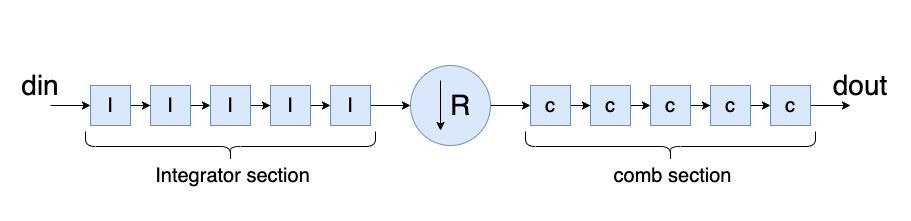
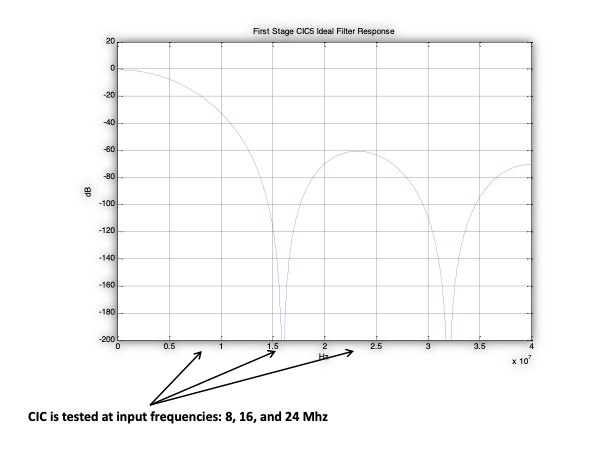

# ECE 524L Fall 2021
**California State University, Northridge**  
**Department of Electrical and Computer Engineering**  

# Lab 2 - Writing VHDL Testbenches Using File IO

## Objective

After completing this lab, students will be able to:
- Write VHDL testbenches to verify the functionality of their design
- Using VHDL TEXT IO to import/export test inputs/outputs
- Analyze a parameterized design

## Requirements

The following material is required to complete the lab:
- Xilinx Vivado 2019.1

## References

- Xilinx FPGA datasheets (available at http://www.xilinx.com)
- Software Manual (available at http://www.support.xilinx.com)

## Introduction

In this lab we are going to learn how to synthesize VHDL code, draw a block diagram that represents the function of the design based on the VHDL code, write VHDL testbench using various methods and finally simulate it to verify the functionality of the design. The VHDL code of a CIC filter is given as reference to you in this repository. Figure 2.1 shows the block diagram of the design. CIC filter consists of two parts: 
1. integrator section 
2. comb section
The integrator part of the filter works based on the 80 MHz clock while the comb section of the filter works based on the 16 MHz clock which translates to a decimation ratio of 5:1. 
 


Figure 2.1 High level block diagram of CIC filter


The frequency response of the CIC filter is given in Figure 2.2. You are going to write VHDL testbenches to verify the functionality of this CIC filter at three points (frequencies) shown on Figure 2.2. Read the procedure part for the instructions on how to write testbenches in different ways. The three frequencies show the passband and stopband frequencies of this filter. You can use Excel application software to do the graphing part of the work since the ISIM simulation software generates only the number values for all signals. Some simulation tools such as Modelsim have graphing modes to view sine waves as well. 



Figure 2.2 CIC filter frequency response

## Procedure

1. Review the VHDL code given to you carefully and draw the detailed block diagram of your design. Also add comments to the source code to show you understand the logic.
2. Generate the free running clock, reset for one cycle and ce_r (decimated clock that generates one clock pulse for every 5 clock cycles). Clock enable (ce) can be tied to logic 1 so the filter is always enabled).
3. Testing at 8 MHz passband: In this region, the filter is supposed to pass the sine wave with some change on magnitude. Apply an 8 MHz sine wave sampled by 80 MHz. This means you need 10 samples, each one applied at a 80 MHz clock and it is repeating. Read the input data samples from a file using TEXT IO and apply the input to the design. Read the output values from the waveform and draw both of the waveforms on the same graph.
4. Testing at 16 MHz: In this region, the filter is supposed to suppress the input sine wave. Apply a 16 MHz sine wave sampled by 80 MHz. This means you need 5 samples, each one applied at a 80 MHz clock and it is repeating. Write a process to apply the input values and write out the results into an output file and draw both on the same graph.
5. Testing at 24 MHz In this region, the filter is supposed to pass the sine wave with some change on magnitude. Apply a 24 MHz sine wave sampled by 80 MHz. This means you need 3.33 samples, each one applied at 80 MHz clock. Apply enough data input samples and use TEXT IO to read/write inputs/results from/into files. Draw both input and output waves on the same graph.

**Note:** You need to obtain the resource utilization of the design and performance from the reports generated by Xilinx tools.

:point_right: **Task 1:** Prepare detailed block diagram of the design.

:point_right: **Task 2:** Prepare input data value samples for all three cases done using Excel application software.

:point_right: **Task 3:** Provide VHDL testbenche for the design for all three cases: 8 MHz.

:point_right: **Task 4:** Provide VHDL testbenche for the design for all three cases: 16 MHz.

:point_right: **Task 5:** Provide VHDL testbenche for the design for all three cases: 24 MHz.


The design given to you is parameterizable for input and output widths as well as the number of stages. Analyze the effects of these parameters on waveforms/area/performance of the design. Present your answers with graphs.

Note: As you can guess, the register width grows as the number of stages grows. The following formula expresses this growth:

```
B_max = [N * log2(R * M) + B]
```

Where:  
N: number of CIC stages  
R: rate change   
M: differential delay in comb stage of the CIC filter  
B: input width  
B_max: maximum number of bits internally  

This information should help you determine how many bits you need to keep the precision as parameters change.

:point_right: **Task 6:** Change the parameters and fill out the following table for different cases. Alternatively you can provide Excel graphs that shows this information.


| | FFS | LUTs | SLICEs | DSP blocks | Performance (ns) |
|--|--|--|--|--|--|
| Filter Length<br/>(5, 10, 15, 20) | | | | | |
| Input Width<br/>(18, 20, 22, 24, 26, 28) | | | | | |

Table 2.1 Area and performance details of different implementations of CIC filter
