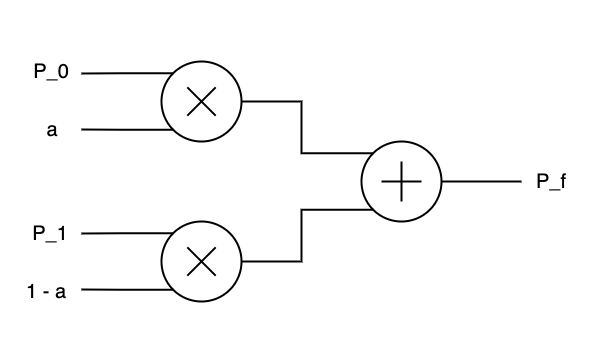

# CSUN ECE 524L Fall 2021
## Lab 3 - FPAG Features Clock Management, DSP Blocks, DDR, and SRL

**Report Created by:**
- Group 7
- Jose Luis Martinez

**Submission date:** 10/12/2021

## Introduction
In this Lab we will be designing a Data Stream interleaver. Essentially this design will take two sinusoidal streams of data and pass through a portion of each and add them together at the output. 
The design diagram is shown below
 **Fig 1**

**P_0** and **P_1** are the sinusoidal inputs and **a** is what portion of each input should be passed through. **P_f** is the output result of the data interleaver. 

The purpose of this lab to try to implement the design as well as using the DSP48. For the first part we are to directly implement the design and use DSP48. For the second portion we are to try and write our VHDL code in a matter where we only use 1 DSP48 block. Lastly one of your signals will be delayed and we are to use a SRL to help sync our signals so they match the original sinusoidal pattern.

## Pre-Lab
For the Pre-Lab I use MATLAB to help generate the data I needed. I used the following code to generate the data needed for the first two parts.

```m
N = 100;
n = 0:99*10;
y1 = 127*sin((2*pi)*(n/N));
y1 = round(y1);
N = 50;
y2 = 60*sin((2*pi)*(n/N));
y2 = round(y2);

% Non Delayed Data
for i = 1:(99*10)+1
     display(y1(i));
    display(y2(i));
end
```

The code below immediately followed and generated the delayed data for the last part.
```m
% Delayed Data
y2 = [ zeros(1,64), y2];
for i = 1:(99*10)+1
    display(y1(i));
    display(y2(i));
end
```

## Questions

Task 1:

:question: **Question 1:** Implement the design. What is the resource utilization of the design? 

Implemented design is in **Procedure** and resource utilization is in **FPGA Resources** sections of the report.

:question: **Question 2:** Have multipliers and adder been mapped to the DSP block? If not, can you force the tool to map these components to the DSP blocks? How do you prove your answers? 

Multipliers are mapped to the DSP block, as seen in the **Results** .section we can see that the inputs for the design are all mapped to the DSP48.

Task 2:

:question: **Question 3:** Implement the design. What is the resource utilization of the design? 

Implemented design is in **Procedure** and resource utilization is in **FPGA Resources** sections of the report.

:question: **Question 4:** Have multipliers and adder been mapped to the DSP block? If not, can you force the tool to map these components to the DSP blocks? How do you prove your answers? 

Multipliers are mapped to the DSP block, as seen in the **Results** .section we can see that the inputs for the design are all mapped to the DSP48.


Task 3:

:question: **Question 5:** Implement the design. What is the resource utilization of the design? 

Implemented design is in **Procedure** and resource utilization is in **FPGA Resources** sections of the report.

## Procedure
1. Designed a direct implementation of the design shown below for part I.
```vhdl
    library IEEE;
use IEEE.STD_LOGIC_1164.ALL;
use IEEE.NUMERIC_STD.ALL;

entity direct_stream_interleaver is
    Port ( p0 : in std_logic_vector(7 downto 0);
           p1 : in std_logic_vector(7 downto 0);
           a : in std_logic_vector(7 downto 0);
           clk: in std_logic;
           rst: in std_logic;
           pout : out std_logic_vector(15 downto 0));
           attribute use_dsp48 : string;
           attribute use_dsp48 of pout : signal is "yes";
end direct_stream_interleaver;

architecture Behavioral of direct_stream_interleaver is


    signal p0s, p1s, as: signed(7 downto 0);
    signal firstHalf, secondHalf: signed(15 downto 0);
    signal result: signed(15 downto 0);
    
begin
    
    p0s <= signed(p0);
    p1s <= signed(p1);
    as <= signed(a);
    
    
    process(clk, rst)
    begin
        if(rst = '1') then
            result <= (others => '0');
        elsif(rising_edge(clk)) then
            firstHalf <= p0s * as;
            secondHalf <= p1s * ("01111111" - as);
            result <= firstHalf + secondHalf;
        else
            result <= result;
        end if;
    end process;
    
    pout <= std_logic_vector(result);

end Behavioral;
```
The design was implemented exactly like how it is in **Fig 1** and the lines `attribute use_dsp48 : string;` and `attribute use_dsp48 of pout : signal is "yes";` were used to force the use of DSP48 in our design.

2. Test-bench was made to verify correct functionality of the design.
3. Schematic was checked to ensure DSP48 was being used.
4. Designed an indirect implementation where the goal was to get the design to only use 1 DSP48. 
5. 5. The clocking wizard was used to generate a faster clock in order to make the design use only 1 DSP48.
6. The design was implemented using the following design diagram.

7. The design is shown below.
```vhdl
library IEEE;
use IEEE.STD_LOGIC_1164.ALL;
use IEEE.NUMERIC_STD.ALL;

entity indirect_stream_interleaver is
    Port (
           p0 : in std_logic_vector(7 downto 0);
           p1 : in std_logic_vector(7 downto 0);
           a : in std_logic_vector(7 downto 0);
           clk: in std_logic;
           rst: in std_logic;
           pout : out std_logic_vector(15 downto 0)
           );
end indirect_stream_interleaver;

architecture Behavioral of indirect_stream_interleaver is

component clk_wiz_0
port
 (-- Clock in ports
  -- Clock out ports
  clk_out1          : out    std_logic;
  clk_out2          : out    std_logic;
  -- Status and control signals
  reset             : in     std_logic;
  clk_in1           : in     std_logic
 );
end component;

signal clk_out1, clk_out2: std_logic;
signal SEL: std_logic := '1';
signal ar, br, p0r, p1r, AMUX, BMUX: signed(7 downto 0);
signal p, temp1, temp2: signed(15 downto 0);
attribute use_dsp48 : string;
attribute use_dsp48 of temp1 : signal is "yes";
begin
  
UUT2 : clk_wiz_0
   port map ( 
  -- Clock out ports  
   clk_out1 => clk_out1,
   clk_out2 => clk_out2,
  -- Status and control signals                
   reset => rst,
   -- Clock in ports
   clk_in1 => clk
 );
 
    process(clk_out1, rst)
    begin
        if(rst = '1') then
            p0r <= (others => '0');
            p1r <= (others => '0');
            ar <= (others => '0');
            br <= (others => '0');
            temp2 <= (others => '0');
        elsif(rising_edge(clk_out1)) then
            p0r <= signed(p0);
            p1r <= signed(p1);
            ar <= signed(a);
            br <= "01111111" - signed(a);
            temp2 <= temp1;
        else
            p0r <= p0r;
            p1r <= p1r;
            ar <= ar;
            br <= br;
            temp2 <= temp2;
        end if;
    end process;

    AMUX <= p0r when (SEL = '0') else
            p1r;
    BMUX <= ar when (SEL = '0') else
            br;
    pout <= std_logic_vector(temp2);
   
    
    process(clk_out2, rst)
    begin
        if(rst = '1') then
            p <= (others => '0');
        elsif(rising_edge(clk_out2)) then
            if(SEL='0') then
                temp1 <= AMUX * BMUX ;
                SEL <= '1';
            else
                temp1 <= temp1 + (AMUX * BMUX);
                SEL <= '0';
            end if;
        else 
            p <= p;
            SEL <= SEL;
        end if;
    end process;

end Behavioral;
```
8. Schematic was checked to ensure only 1 DSP48 was being used.
9. Test-bench was made to verify correct functionality of the design.
10. Using the shifted data from the Pre-Lab, I designed a Data Interleaver by adding a SRL using the IP wizard in Vivado to the design from part 2.
11. The design is shown below. 
```vhdl
library IEEE;
use IEEE.STD_LOGIC_1164.ALL;
use IEEE.NUMERIC_STD.ALL;

entity dsi_with_srl is
    Port (
           p0 : in std_logic_vector(7 downto 0);
           p1 : in std_logic_vector(7 downto 0);
           a : in std_logic_vector(7 downto 0);
           clk: in std_logic;
           rst: in std_logic;
           pout : out std_logic_vector(15 downto 0)
           );
end dsi_with_srl;

architecture Behavioral of dsi_with_srl is

component clk_wiz_0
port
 (
  clk_out1          : out    std_logic;
  clk_out2          : out    std_logic;
  reset             : in     std_logic;
  clk_in1           : in     std_logic
 );
end component;

COMPONENT c_shift_ram_0
  PORT (
    D : IN STD_LOGIC_VECTOR(7 DOWNTO 0);
    CLK : IN STD_LOGIC;
    Q : OUT STD_LOGIC_VECTOR(7 DOWNTO 0)
  );
END COMPONENT;

signal clk_out1, clk_out2: std_logic;
signal SEL: std_logic := '1';
signal ar, br, p0r, p1r, AMUX, BMUX: signed(7 downto 0);
signal p0_d: std_logic_vector(7 downto 0);
signal p, temp1, temp2: signed(15 downto 0);
attribute use_dsp48 : string;
attribute use_dsp48 of temp1 : signal is "yes";
begin
  
UUT1 : clk_wiz_0
   port map ( 
   clk_out1 => clk_out1,
   clk_out2 => clk_out2,               
   reset => rst,
   clk_in1 => clk
 );
 
 UUT2 : c_shift_ram_0
  PORT MAP (
    D => p0,
    CLK => clk_out1,
    Q => p0_d
  );
 
    process(clk_out1, rst)
    begin
        if(rst = '1') then
            p0r <= (others => '0');
            p1r <= (others => '0');
            ar <= (others => '0');
            br <= (others => '0');
            temp2 <= (others => '0');
        elsif(rising_edge(clk_out1)) then
            p0r <= signed(p0_d);
            p1r <= signed(p1);
            ar <= signed(a);
            br <= "01111111" - signed(a);
            temp2 <= temp1;
        else
            p0r <= p0r;
            p1r <= p1r;
            ar <= ar;
            br <= br;
            temp2 <= temp2;
        end if;
    end process;

    AMUX <= p0r when (SEL = '0') else
            p1r;
    BMUX <= ar when (SEL = '0') else
            br;
    pout <= std_logic_vector(temp2);
   
    
    process(clk_out2, rst)
    begin
        if(rst = '1') then
            p <= (others => '0');
        elsif(rising_edge(clk_out2)) then
            if(SEL='0') then
                temp1 <= AMUX * BMUX ;
                SEL <= '1';
            else
                temp1 <= temp1 + (AMUX * BMUX);
                SEL <= '0';
            end if;
        else 
            p <= p;
            SEL <= SEL;
        end if;
```

12. Test-bench was made to verify correct functionality of the design.
13. All schematics are in the **Results** section.

## Testing Strategy
For the testing one test-bench was made to test all of the designs. The test-bench file read two text files containing the sinusoidal data for all parts. Part I and II all received the same data while Part III received the shifted data. Three cases per design, one where a = 0, another where a = 127 and lastly one where a = 55. The test-bench design is shown below:
```vhdl
library IEEE;
use IEEE.STD_LOGIC_1164.ALL;
use IEEE.NUMERIC_STD.ALL;
use std.textio.all;
use ieee.std_logic_textio.all;

entity dsi_tb is
--  Port ( );
end dsi_tb;

architecture Behavioral of dsi_tb is

component direct_stream_interleaver is
    Port ( p0 : in std_logic_vector(7 downto 0);
           p1 : in std_logic_vector(7 downto 0);
           a : in std_logic_vector(7 downto 0);
           clk: in std_logic;
           rst: in std_logic;
           pout : out std_logic_vector(15 downto 0));
end component direct_stream_interleaver;

component indirect_stream_interleaver is
    Port (
           p0 : in std_logic_vector(7 downto 0);
           p1 : in std_logic_vector(7 downto 0);
           a : in std_logic_vector(7 downto 0);
           clk: in std_logic;
           rst: in std_logic;
           pout : out std_logic_vector(15 downto 0)
           );
end component indirect_stream_interleaver;

component dsi_with_srl is
    Port (
           p0 : in std_logic_vector(7 downto 0);
           p1 : in std_logic_vector(7 downto 0);
           a : in std_logic_vector(7 downto 0);
           clk: in std_logic;
           rst: in std_logic;
           pout : out std_logic_vector(15 downto 0)
           );
end component dsi_with_srl;

signal p0_tb, p1_tb, a1_tb, a2_tb, a3_tb, p1_d_tb: std_logic_vector(7 downto 0);
signal clk_tb, rst_tb: std_logic;
signal pout1_tb, pout2_tb, pout3_tb: std_logic_vector(15 downto 0);
signal pout4_tb, pout5_tb, pout6_tb: std_logic_vector(15 downto 0);
signal pout7_tb, pout8_tb, pout9_tb: std_logic_vector(15 downto 0);

begin

    uut0: direct_stream_interleaver port map (p0 => p0_tb, p1 => p1_tb, a => a1_tb, clk => clk_tb, rst => rst_tb, pout => pout1_tb);
    uut1: direct_stream_interleaver port map (p0 => p0_tb, p1 => p1_tb, a => a2_tb, clk => clk_tb, rst => rst_tb, pout => pout2_tb);
    uut2: direct_stream_interleaver port map (p0 => p0_tb, p1 => p1_tb, a => a3_tb, clk => clk_tb, rst => rst_tb, pout => pout3_tb);
    uut3: indirect_stream_interleaver port map (p0 => p0_tb, p1 => p1_tb, a => a1_tb, clk => clk_tb, rst => rst_tb, pout => pout4_tb);
    uut4: indirect_stream_interleaver port map (p0 => p0_tb, p1 => p1_tb, a => a2_tb, clk => clk_tb, rst => rst_tb, pout => pout5_tb);
    uut5: indirect_stream_interleaver port map (p0 => p0_tb, p1 => p1_tb, a => a3_tb, clk => clk_tb, rst => rst_tb, pout => pout6_tb);
    uut6: dsi_with_srl port map (p0 => p0_tb, p1 => p1_d_tb, a => a1_tb, clk => clk_tb, rst => rst_tb, pout => pout7_tb);
    uut7: dsi_with_srl port map (p0 => p0_tb, p1 => p1_d_tb, a => a2_tb, clk => clk_tb, rst => rst_tb, pout => pout8_tb);
    uut8: dsi_with_srl port map (p0 => p0_tb, p1 => p1_d_tb, a => a3_tb, clk => clk_tb, rst => rst_tb, pout => pout9_tb);
       
    a1_tb <= "01111111";
    a2_tb <= "00000000";
    a3_tb <= "00110111";
    
    
    process
        file in_file: text open read_mode is "/home/josemrtnz/Documents/ECE524L/fa21-e524-lab-assignment3-group-7/Lab3/Lab3.srcs/sim_1/new/input.txt";
        file in_delay_file: text open read_mode is "/home/josemrtnz/Documents/ECE524L/fa21-e524-lab-assignment3-group-7/Lab3/Lab3.srcs/sim_1/new/input_delay.txt";
        
        variable in_line: line;
        variable data: integer;   
    begin
        while not endfile(in_file) loop
            readline(in_file, in_line);
            read(in_line, data);
            p0_tb <= std_logic_vector(to_signed(data, 8));
            readline(in_file, in_line);
            read(in_line, data);
            p1_tb <= std_logic_vector(to_signed(data, 8));
            readline(in_delay_file, in_line);
            readline(in_delay_file, in_line);
            read(in_line, data);
            p1_d_tb <= std_logic_vector(to_signed(data, 8));
            wait for 12.5ns;
        end loop;
        file_close(in_file);
        wait;
    end process;
    
    process
    begin
        clk_tb <= '0';
        wait for 6.25ns;
        clk_tb <= '1';
        wait for 6.25ns;
    end process;
    
    process
    begin
    rst_tb <= '1';
    wait for 5ns;
    rst_tb <= '0';
    wait;
    end process;

end Behavioral;
```

## Results (Data)
### Schematics
#### Part I
 **Direct Implementation Schematic** 
 **Zoomed in**
#### Part II
 **Indirect Implementation Schematic**
 **Zoomed in**
#### Part III
 **Indirect Implementation Schematic w SRL** 
 **Zoomed in**

## FPGA Resources
#### Part I

 

**Report Utilization**
#### Part II

 

**Report Utilization**
#### Part III

 

**Report Utilization**

### Waveforms 


## Conclusion
In conclusion, I learned about data interleavers, DSP48, and how to force the use of them in VHDL. I also got to practice more with reading values from text files for simulation. I was able to preform all of the required task of this lab and my Schematics and Waveforms are there to prove it. 

