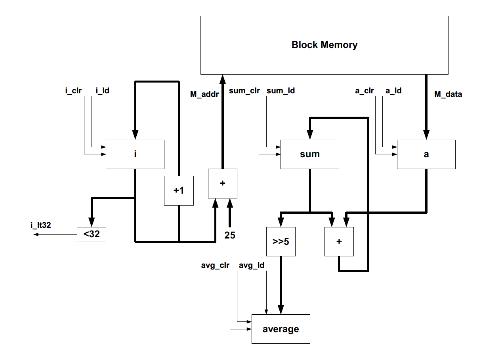
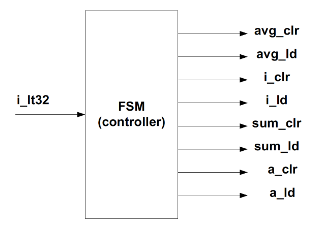
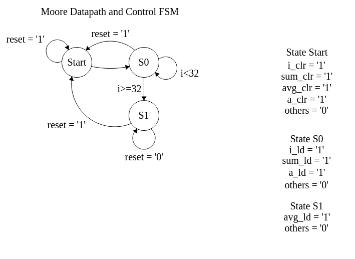
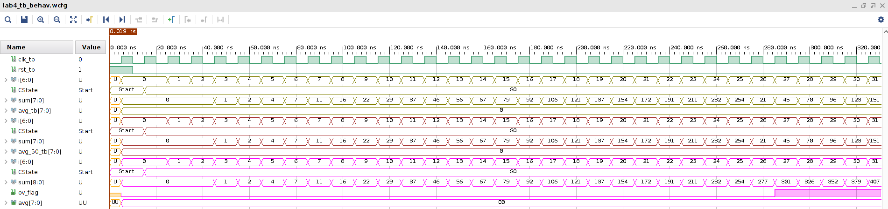
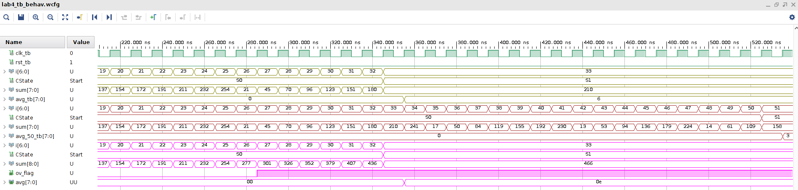
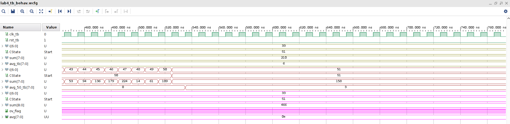
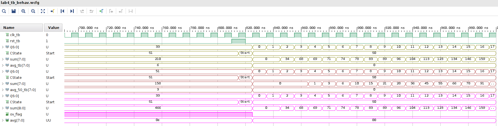
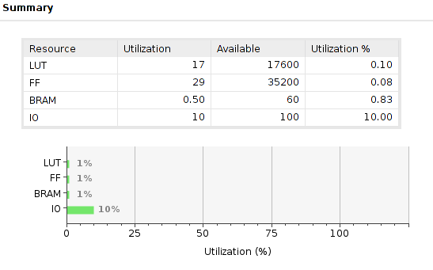
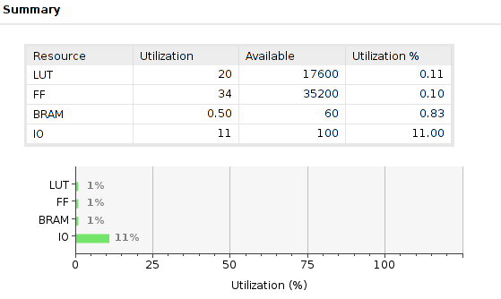
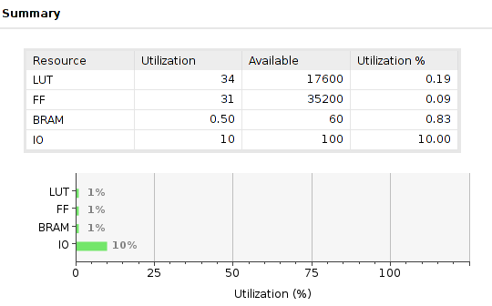

# CSUN ECE 524L Fall 2021
## Lab 4 - Datapath and Control Path

**Report Created by:**
- Group 7
- Jose Luis Martinez

**Submission date:** 10/26/2021

## Introduction
For this lab we are to implement a control and data path FSM as shown in the design diagram shown below. The data path should include a register for i, sum, a, average, a comparator, 2 adders, a right shifter, and finally one block ram module. The FSM control path should control the load and clears for each of the registers while the data path will simply connect everything everything and accept input from the FSM control path.


## Pre-Lab

:question: **Question 1:** Estimate the FPGA area in terms of LUTs, FFs, memory, etc. for the design shown in Figure 4.1 and elaborate your answer.

For the Data Path portion for of the design, I estimate 8 FFs for each I, sum, a, and avg. The comparator would be 8 LUTS, the two adders would be another 8 LUTS each, and the shift right would take 1 LUT. The FSM Control PAth would take only 3 FF since three states have a unique signal thus only requiring 3 FFs to implement. 3 muxes are need also needed to implement so three more LUTs. In total 51 FFs, 28 Luts, and block RAM are needed for this design.

:question: **Question 2:** Draw the state diagram for FSM. The state machine block diagram is shown in Figure 4.2. 

#### Moore FSM


**Questions 3:** What is the FPGA area utilization for your design? How does this compare with your estimation in question 1? Explain your answer.


## Procedure
1. I drew and designed a Moore FSM as shown in the **Pre-Lab**.
2. FSM for Task 1 `fsm_lab4.vhd` was designed as shown below. This will be the control path for our design.
3. Data path for Task 1 `data_path.vhd` was designed as shown below. This will contain all of the data and paths to where registers and memory should go to.
4. A top level module was used to connect the fsm and data path modules together as shown below in `top_level.vhd`.
5. For Task 2 the top level and data path were modified to include overflow flags as shown in `top_level_ov.vhd` and `data_path_ov.vhd`.
6. For Task 3 the data flow was modified to I count to 50 and average 50 numbers now from BRAM. The modified design is shown below in `data_path_2.vhd`.
7. A test bench was designed to test all of these modules at once as shown in the **Testing Strategy** section.

`fsm_lab4.vhd`
```vhdl
library IEEE;
use IEEE.STD_LOGIC_1164.ALL;
use IEEE.NUMERIC_STD.ALL;


entity fsm_lab4 is
    Port ( clk, rst, i_lt32: in std_logic;
           i_clr, i_ld: out std_logic;
           sum_clr, sum_ld: out std_logic;
           a_clr, a_ld: out std_logic;
           avg_clr, avg_ld: out std_logic);
end fsm_lab4;

architecture Behavioral of fsm_lab4 is

type StateType is (Start, S0, S1);
signal CState, NState: StateType;

begin

NState_Logic: process(CState, i_lt32)
begin
    case CState is 
        when Start =>
            NState <= S0;
            
            i_clr <= '1';
            i_ld <= '0';
            sum_clr <= '1';
            sum_ld <= '0';
            avg_clr <= '1';
            avg_ld <= '0';
            a_clr <= '1';
            a_ld <= '0';
            
            
        when S0 =>
             if(i_lt32 = '0') then
                NState <= S1;
             else 
                NState <= S0;
             end if;
             
            i_clr <= '0';
            i_ld <= '1';
            sum_clr <= '0';
            sum_ld <= '1';
            avg_clr <= '0';
            avg_ld <= '0';
            a_clr <= '0';
            a_ld <= '1';
             
        when S1 =>
             NState <= S1;
             
            i_clr <= '0';
            i_ld <= '0';
            sum_clr <= '0';
            sum_ld <= '0';
            avg_clr <= '0';
            avg_ld <= '1';
            a_clr <= '0';
            a_ld <= '0';
                  
        when others =>
            NState <= Start;
            
            i_clr <= '0';
            i_ld <= '0';
            sum_clr <= '0';
            sum_ld <= '0';
            avg_clr <= '0';
            avg_ld <= '0';
            a_clr <= '0';
            a_ld <= '0';
            
    end case;
end process;

process(clk)
begin
    if(rising_edge(clk)) then
        if(rst = '1') then
            CState <= Start;
        else 
            CState <= NState;
        end if;
    else 
        CState <= CState;
    end if;
end process;

end Behavioral;
```
`data_path.vhd`
```vhdl
library IEEE;
use IEEE.STD_LOGIC_1164.ALL;
use IEEE.NUMERIC_STD.ALL;


entity data_path is
    Port ( clk, rst: std_logic;
           i_clr, i_ld: std_logic;
           a_clr, a_ld: std_logic;
           sum_clr, sum_ld: std_logic;
           avg_clr, avg_ld: std_logic;
           avg: out std_logic_vector(7 downto 0);
           i_lt32: out std_logic);
end data_path;

architecture Behavioral of data_path is

COMPONENT blk_mem_gen_0
  PORT (
    clka : IN STD_LOGIC;
    ena : IN STD_LOGIC;
    wea : IN STD_LOGIC_VECTOR(0 DOWNTO 0);
    addra : IN STD_LOGIC_VECTOR(6 DOWNTO 0);
    dina : IN STD_LOGIC_VECTOR(7 DOWNTO 0);
    douta : OUT STD_LOGIC_VECTOR(7 DOWNTO 0)
  );
END COMPONENT;

    signal ena: std_logic;
    signal wea: std_logic_vector(0 downto 0) := "0";
    signal addra: std_logic_vector(6 downto 0);
    signal dina, douta, a: std_logic_vector(7 downto 0);
    signal i: unsigned(6 downto 0);
    signal sum: unsigned(7 downto 0);
begin

block_ram1 : blk_mem_gen_0
  PORT MAP ( clka => clk, ena => ena, wea => wea, addra => addra, dina => dina, douta => douta);
  
i_data_path: process(clk)
begin
    if(rising_edge(clk)) then
        if(i_clr = '1') then
            i <= (others => '0');
        elsif (i_ld = '1') then
            i <= i + "1";
        else 
            i <= i;
        end if;
    end if;
end process;

a_data_path: process(clk)
begin
    if(rising_edge(clk)) then
        if(a_clr = '1') then
            a <= (others => '0');
        elsif (a_ld = '1') then
            a <= douta;
        else 
            a <= a;
        end if;
    end if;
end process;

sum_data_path: process(clk)
begin
    if(rising_edge(clk)) then
        if(sum_clr = '1') then
            sum <= (others => '0');
        elsif (sum_ld = '1') then
            sum <= sum + unsigned(a);
        else 
            sum <= sum;
        end if;
    end if;
end process;

avg_data_path: process(clk)
begin
    if(rising_edge(clk)) then
        if(avg_clr = '1') then
            avg <= (others => '0');
        elsif (avg_ld = '1') then
            avg <= std_logic_vector(shift_right(sum, 5));
        end if;
    end if;
end process;

comparator: process(i)
begin
    if(i<32) then
        i_lt32 <= '1';
    else 
        i_lt32 <= '0';
    end if;
end process;

addra <= std_logic_vector(i + 25);
ena <= '1';

end Behavioral;
```

`top_level.vhd`
```vhdl
library IEEE;
use IEEE.STD_LOGIC_1164.ALL;
use IEEE.NUMERIC_STD.ALL;

entity top_level is
    Port ( clk, rst: in std_logic;
           avg: out std_logic_vector(7 downto 0));
end top_level;

architecture Behavioral of top_level is

    component data_path is
    Port ( clk, rst: std_logic;
           i_clr, i_ld: std_logic;
           a_clr, a_ld: std_logic;
           sum_clr, sum_ld: std_logic;
           avg_clr, avg_ld: std_logic;
           avg: out std_logic_vector(7 downto 0);
           i_lt32: out std_logic);
    end component data_path;
    
    component fsm_lab4 is
    Port ( clk, rst, i_lt32: in std_logic;
           i_clr, i_ld: out std_logic;
           sum_clr, sum_ld: out std_logic;
           a_clr, a_ld: out std_logic;
           avg_clr, avg_ld: out std_logic);
    end component fsm_lab4;

    signal i_clr, i_lt32, i_ld, sum_clr, sum_ld, a_clr, a_ld, avg_clr, avg_ld: std_logic; 

begin

    data_path_1: data_path port map (clk => clk, rst => rst, i_clr => i_clr, i_ld => i_ld, a_clr => a_clr,
                          a_ld => a_ld, sum_clr => sum_clr, sum_ld => sum_ld, avg_clr => avg_clr, 
                          avg_ld => avg_ld, avg => avg, i_lt32 => i_lt32);
                          
    fsm_lab4_1: fsm_lab4 port map (clk => clk, rst => rst, i_clr => i_clr, i_ld => i_ld, a_clr => a_clr,
                          a_ld => a_ld, sum_clr => sum_clr, sum_ld => sum_ld, avg_clr => avg_clr, 
                          avg_ld => avg_ld, i_lt32 => i_lt32);

end Behavioral;
```

`data_path_ov.vhd`
```vhdl
library IEEE;
use IEEE.STD_LOGIC_1164.ALL;
use IEEE.NUMERIC_STD.ALL;


entity data_path_ov is
    Port ( clk, rst: std_logic;
           i_clr, i_ld: std_logic;
           a_clr, a_ld: std_logic;
           sum_clr, sum_ld: std_logic;
           avg_clr, avg_ld: std_logic;
           avg: out std_logic_vector(7 downto 0);
           i_lt32, ov_flag: out std_logic);
end data_path_ov;

architecture Behavioral of data_path_ov is

COMPONENT blk_mem_gen_0
  PORT (
    clka : IN STD_LOGIC;
    ena : IN STD_LOGIC;
    wea : IN STD_LOGIC_VECTOR(0 DOWNTO 0);
    addra : IN STD_LOGIC_VECTOR(6 DOWNTO 0);
    dina : IN STD_LOGIC_VECTOR(7 DOWNTO 0);
    douta : OUT STD_LOGIC_VECTOR(7 DOWNTO 0)
  );
END COMPONENT;

    signal ena: std_logic;
    signal wea: std_logic_vector(0 downto 0) := "0";
    signal addra: std_logic_vector(6 downto 0);
    signal dina, douta, a: std_logic_vector(7 downto 0);
    signal i: unsigned(6 downto 0);
    signal sum: unsigned(8 downto 0);
begin

block_ram1 : blk_mem_gen_0
  PORT MAP ( clka => clk, ena => ena, wea => wea, addra => addra, dina => dina, douta => douta);
  
i_data_path: process(clk)
begin
    if(rising_edge(clk)) then
        if(i_clr = '1') then
            i <= (others => '0');
        elsif (i_ld = '1') then
            i <= i + "1";
        else 
            i <= i;
        end if;
    end if;
end process;

a_data_path: process(clk)
begin
    if(rising_edge(clk)) then
        if(a_clr = '1') then
            a <= (others => '0');
        elsif (a_ld = '1') then
            a <= douta;
        else 
            a <= a;
        end if;
    end if;
end process;

sum_data_path: process(clk)
begin
    if(rising_edge(clk)) then
        if(sum_clr = '1') then
            sum <= (others => '0');
            ov_flag <= '0';
        elsif (sum_ld = '1') then
            sum <= sum + unsigned(a);
            if(sum(8) = '1') then
                ov_flag <= '1';
            end if;
        else 
            sum <= sum;
        end if;
    end if;
end process;

avg_data_path: process(clk)
begin
    if(rising_edge(clk)) then
        if(avg_clr = '1') then
            avg <= (others => '0');
        elsif (avg_ld = '1') then
            avg <= std_logic_vector(resize(shift_right(sum, 5), 8));
        end if;
    end if;
end process;

comparator: process(i)
begin
    if(i<32) then
        i_lt32 <= '1';
    else 
        i_lt32 <= '0';
    end if;
end process;

addra <= std_logic_vector(i + 25);
ena <= '1';

end Behavioral;
```

`top_level_ov.vhd`
```vhdl
library IEEE;
use IEEE.STD_LOGIC_1164.ALL;
use IEEE.NUMERIC_STD.ALL;

entity top_level_ov is
    Port ( clk, rst: in std_logic;
           ov_flag: out std_logic;
           avg: out std_logic_vector(7 downto 0));
end top_level_ov;

architecture Behavioral of top_level_ov is

    component data_path_ov is
    Port ( clk, rst: std_logic;
           i_clr, i_ld: std_logic;
           a_clr, a_ld: std_logic;
           sum_clr, sum_ld: std_logic;
           avg_clr, avg_ld: std_logic;
           avg: out std_logic_vector(7 downto 0);
           i_lt32, ov_flag: out std_logic);
    end component data_path_ov;
    
    component fsm_lab4 is
    Port ( clk, rst, i_lt32: in std_logic;
           i_clr, i_ld: out std_logic;
           sum_clr, sum_ld: out std_logic;
           a_clr, a_ld: out std_logic;
           avg_clr, avg_ld: out std_logic);
    end component fsm_lab4;

    signal i_clr, i_lt32, i_ld, sum_clr, sum_ld, a_clr, a_ld, avg_clr, avg_ld: std_logic; 

begin

    data_path_1: data_path_ov port map (clk => clk, rst => rst, i_clr => i_clr, i_ld => i_ld, a_clr => a_clr,
                          a_ld => a_ld, sum_clr => sum_clr, sum_ld => sum_ld, avg_clr => avg_clr, 
                          avg_ld => avg_ld, avg => avg, i_lt32 => i_lt32, ov_flag => ov_flag);
                          
    fsm_lab4_1: fsm_lab4 port map (clk => clk, rst => rst, i_clr => i_clr, i_ld => i_ld, a_clr => a_clr,
                          a_ld => a_ld, sum_clr => sum_clr, sum_ld => sum_ld, avg_clr => avg_clr, 
                          avg_ld => avg_ld, i_lt32 => i_lt32);

end Behavioral;
```

`data_path_2.vhd`
```vhdl
library IEEE;
use IEEE.STD_LOGIC_1164.ALL;
use IEEE.NUMERIC_STD.ALL;


entity data_path_2 is
    Port ( clk, rst: std_logic;
           i_clr, i_ld: std_logic;
           a_clr, a_ld: std_logic;
           sum_clr, sum_ld: std_logic;
           avg_clr, avg_ld: std_logic;
           avg: out std_logic_vector(7 downto 0);
           i_lt50: out std_logic);
end data_path_2;

architecture Behavioral of data_path_2 is

COMPONENT blk_mem_gen_0
  PORT (
    clka : IN STD_LOGIC;
    ena : IN STD_LOGIC;
    wea : IN STD_LOGIC_VECTOR(0 DOWNTO 0);
    addra : IN STD_LOGIC_VECTOR(6 DOWNTO 0);
    dina : IN STD_LOGIC_VECTOR(7 DOWNTO 0);
    douta : OUT STD_LOGIC_VECTOR(7 DOWNTO 0)
  );
END COMPONENT;

    signal ena: std_logic;
    signal wea: std_logic_vector(0 downto 0) := "0";
    signal addra: std_logic_vector(6 downto 0);
    signal dina, douta, a: std_logic_vector(7 downto 0);
    signal i: unsigned(6 downto 0);
    signal sum: unsigned(7 downto 0);
begin

block_ram1 : blk_mem_gen_0
  PORT MAP ( clka => clk, ena => ena, wea => wea, addra => addra, dina => dina, douta => douta);
  
i_data_path: process(clk)
begin
    if(rising_edge(clk)) then
        if(i_clr = '1') then
            i <= (others => '0');
        elsif (i_ld = '1') then
            i <= i + "1";
        else 
            i <= i;
        end if;
    end if;
end process;

a_data_path: process(clk)
begin
    if(rising_edge(clk)) then
        if(a_clr = '1') then
            a <= (others => '0');
        elsif (a_ld = '1') then
            a <= douta;
        else 
            a <= a;
        end if;
    end if;
end process;

sum_data_path: process(clk)
begin
    if(rising_edge(clk)) then
        if(sum_clr = '1') then
            sum <= (others => '0');
        elsif (sum_ld = '1') then
            sum <= sum + unsigned(a);
        else 
            sum <= sum;
        end if;
    end if;
end process;

avg_data_path: process(clk)
begin
    if(rising_edge(clk)) then
        if(avg_clr = '1') then
            avg <= (others => '0');
        elsif (avg_ld = '1') then
            avg <= std_logic_vector(sum / 50);
        end if;
    end if;
end process;

comparator: process(i)
begin
    if(i<50) then
        i_lt50 <= '1';
    else 
        i_lt50 <= '0';
    end if;
end process;

addra <= std_logic_vector(i + 25);
ena <= '1';

end Behavioral;   
```

## Testing Strategy
I used one test bench for all the Tasks in this lab. All of the Top Level modules got the same clk and reset. Overflow flag was connected to the design with overflow detection. Each design got assigned their own avg signal in order to differentiate their end results.
```vhdl
library IEEE;
use IEEE.STD_LOGIC_1164.ALL;
use IEEE.NUMERIC_STD.ALL;

entity lab4_tb is
--  Port ( );
end lab4_tb;

architecture Behavioral of lab4_tb is
    component top_level is
        Port ( clk, rst: in std_logic;
               avg: out std_logic_vector(7 downto 0));
    end component top_level;
    
    component top_level_50 is
    Port ( clk, rst: in std_logic;
           avg: out std_logic_vector(7 downto 0));
    end component top_level_50;
    
    component top_level_ov is
    Port ( clk, rst: in std_logic;
           ov_flag: out std_logic;
           avg: out std_logic_vector(7 downto 0));
    end component top_level_ov;
    
    signal clk_tb, rst_tb, ov_flag: std_logic;
    signal avg_tb, avg_50_tb, avg_ov_tb: std_logic_vector(7 downto 0);
begin

uut1: top_level port map (clk => clk_tb, rst => rst_tb, avg => avg_tb);
uut2: top_level_50 port map (clk => clk_tb, rst => rst_tb, avg => avg_50_tb);
uut3: top_level_ov port map (clk => clk_tb, rst => rst_tb, avg => avg_ov_tb, ov_flag => ov_flag);

    process
    begin
        clk_tb <= '0';
        wait for 5ns;
        clk_tb <= '1';
        wait for 5ns;
    end process;
    
    process
    begin
        rst_tb <= '1';
        wait for 10ns;
        rst_tb <= '0';
        wait for 800ns;
    end process;

end Behavioral;
```
## Results (Data)
From the results below we can see that each designs FSM control path was working as intended. However we seem to get the incorrect average for each of tasks, for example for task 1 & 2 the average was 6. When clearly most of the value were above 6 and the same thing happened to task 3. This is due to the fact that the sum register is only 8 bits wide. Meaning that the maximum value the register can hold is 255. This is a big flaw in the design but however since specifications were not given I left at is as the next Task was to implement overflow detection. When the overflow was detected the overflow flag was risen and remained that way until the FSM was reset. Task 3 is shown working as the i keeps counting to 50 and the last value in the sum gets divided by 50.







## FPGA Resources
#### Resource Utilization Task 1


#### Resource Utilization Task 2


#### Resource Utilization Task 3


## Conclusion
In conclusion, I implemented a Control Path FSM, a data path module that is controlled by FSM, modified it indicate overflow, and modified the design to take the average of 50 numbers. I learned about and how to implement control paths and data paths in this lab. This lab was good practice in how to design FSM and how to use them in controlling data paths.

